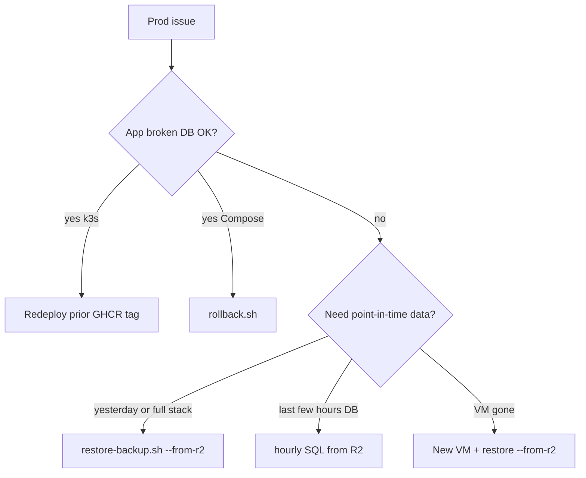

# Cullinos — Backup & one-click rollback (VM)

Production runs on a single OnLiveServer VM. After the k3s cutover, **app rollback** is image-tag redeploy via GitHub Actions; **DB backup** still uses R2. Compose-era scripts under `/opt/cullinos/scripts/prod/` remain valid until Compose is fully retired.

## k3s (current path)

| Action | How |
|--------|-----|
| App rollback (DB fine) | Actions → **Deploy Production** → `workflow_dispatch` with previous image SHA (`Build Images` short SHA tag) |
| DB dump from cluster | `bash infrastructure/k8s/scripts/backup-pg-k8s.sh production` |
| Point-in-time DB | Prefer R2 daily/hourly dumps (below); restore into the `postgres` pod with `psql` |
| Monitoring | Grafana `https://grafana.cullinos.com` + Sentry (DSN in `cullinos-secrets`) |

Cutover notes: [`infrastructure/k8s/scripts/cutover-checklist.md`](../infrastructure/k8s/scripts/cutover-checklist.md).

## Compose-era scripts (legacy / transitional)

These scripts live on the server under `/opt/cullinos/scripts/prod/` while Compose volumes still exist:

| Script | Purpose |
|--------|---------|
| `snapshot-release.sh` | After a good deploy — tag API/web images + snapshot frontends/config |
| `rollback.sh` | One-command Compose app rollback (images + static SPAs). **Does not restore DB** |
| `backup.sh` | Daily pack → **Cloudflare R2** (local staging only; purged after upload) |
| `backup-db-hourly.sh` | Hourly Postgres dump → **R2** (local file deleted after upload) |
| `restore-backup.sh` | Disaster restore (prefer `--from-r2`) |
| `install-cron.sh` | Create dirs + daily/hourly cron |

**R2 is the source of truth** for daily/hourly backups (`BACKUP_KEEP_LOCAL_DAYS=0` by default). On the VM you keep:

- `/var/backups/cullinos/LAST_BACKUP.json` / `LAST_HOURLY.json` — last run status
- `/var/backups/cullinos/releases/` — app rollback snapshots only (not full DB)

## Incident decision tree

| Situation | Action |
|-----------|--------|
| Bad deploy, API/UI broken, **DB fine** (k3s) | Redeploy prior image tag via Deploy Production |
| Bad deploy (Compose still live) | `bash /opt/cullinos/scripts/prod/rollback.sh` |
| Need a named prior Compose release | `bash .../rollback.sh --list` then `rollback.sh <id>` |
| Bad data / need **yesterday** | `bash .../restore-backup.sh YYYY-MM-DD --from-r2` (type `RESTORE`) |
| Need data from **a few hours ago** | Restore hourly SQL from R2 (see below) |
| Whole VM dead | New VM + k3s install + `restore-backup.sh YYYY-MM-DD --from-r2` |



## First-time setup

1. Create a **private** Cloudflare R2 bucket (e.g. `cullinos-backups`). Do not reuse the public CMS/media bucket.
2. On the VM `.env` (see [`.env.production.example`](../.env.production.example)):

```bash
R2_ACCOUNT_ID=...   # must match Cloudflare dashboard Account ID exactly (TLS fails if wrong)
R2_ACCESS_KEY_ID=...
R2_SECRET_ACCESS_KEY=...
R2_BACKUP_BUCKET=cullinos-backups
R2_ENDPOINT=https://<ACCOUNT_ID>.r2.cloudflarestorage.com
BACKUP_LOCAL_DIR=/var/backups/cullinos
BACKUP_KEEP_LOCAL_DAYS=0              # 0 = R2-only (default); set >0 to keep N days on disk
BACKUP_KEEP_R2_DAYS=30
RELEASE_KEEP_COUNT=5
BACKUP_INCLUDE_IMAGES=weekly          # weekly|always|never — docker save only Sundays by default
BACKUP_HOURLY_KEEP_HOURS=72           # R2 hourly retention only
# BACKUP_ALERT_WEBHOOK=https://hooks.slack.com/services/...
# BACKUP_ALERT_ON=fail                # fail|always
```

Install **AWS CLI v2** on the VM (`/usr/local/bin/aws`) for reliable R2 uploads. Ubuntu’s `awscli` 1.x often hits TLS handshake errors against R2.

3. Install cron + dirs:

```bash
bash /opt/cullinos/scripts/prod/install-cron.sh
```

Crons installed:

| Schedule | Script | Log |
|----------|--------|-----|
| `0 2 * * *` | `/bin/bash …/backup.sh` | `/var/log/cullinos-backup.log` |
| `5 * * * *` | `/bin/bash …/backup-db-hourly.sh` | `/var/log/cullinos-backup-hourly.log` |

Cron invokes scripts via `/bin/bash` so a missing execute bit (common after Windows→VM uploads) does not break backups.

4. Run one manual backup:

```bash
bash /opt/cullinos/scripts/prod/backup.sh
bash /opt/cullinos/scripts/prod/backup-db-hourly.sh
cat /var/backups/cullinos/LAST_BACKUP.json
# Local daily/hourly packs should be gone after success; list R2 instead:
# aws s3 ls s3://$R2_BACKUP_BUCKET/cullinos/daily/ --endpoint-url $R2_ENDPOINT
```

5. After API is healthy, snapshot for rollback:

```bash
bash /opt/cullinos/scripts/prod/snapshot-release.sh
```

`remote-deploy.py` calls `snapshot-release.sh` automatically after a healthy deploy.

## Bad deploy → one-click rollback

```bash
bash /opt/cullinos/scripts/prod/rollback.sh --list
bash /opt/cullinos/scripts/prod/rollback.sh
# or
bash /opt/cullinos/scripts/prod/rollback.sh 20260916-153045-a1b2c3d
```

Restores API/web images + `/var/www/cullinos` frontends. **Does not** restore Postgres/Redis.

## Daily backup contents (R2)

Uploaded to `s3://$R2_BACKUP_BUCKET/cullinos/daily/YYYY-MM-DD/`:

- `postgres.sql.gz`
- `redis.rdb.gz` (best-effort)
- `frontends.tar.gz`
- `uploads.tar.gz` (marketing volume, if present)
- `config.tar.gz` (`.env`, compose, nginx, secrets)
- `images.tar.gz` — only when `BACKUP_INCLUDE_IMAGES=always`, or **Sunday UTC** when `weekly` (default)
- `manifest.json`

Retention: **no local keep** by default (`BACKUP_KEEP_LOCAL_DAYS=0`); **30 days** on R2. Last **5** release snapshots kept on VM under `releases/`.

If R2 upload fails, the local staging pack for that run is left for inspection and the job exits non-zero.

On finish: writes `LAST_BACKUP.json` and posts to `BACKUP_ALERT_WEBHOOK` on failure (`BACKUP_ALERT_ON=fail`, default).

## Hourly DB backup (R2)

- R2: `s3://$R2_BACKUP_BUCKET/cullinos/hourly/YYYY-MM-DD/HH.sql.gz`
- Keep on R2: `BACKUP_HOURLY_KEEP_HOURS` (default **72**)
- Local file deleted after successful upload
- Status: `LAST_HOURLY.json`

### Restore an hourly dump (DB only)

```bash
set -a; source /opt/cullinos/.env; set +a
export AWS_ACCESS_KEY_ID="$R2_ACCESS_KEY_ID" AWS_SECRET_ACCESS_KEY="$R2_SECRET_ACCESS_KEY" AWS_DEFAULT_REGION=auto

/usr/local/bin/aws s3 cp s3://cullinos-backups/cullinos/hourly/2026-09-17/14.sql.gz /tmp/hour.sql.gz \
  --endpoint-url "$R2_ENDPOINT"

cd /opt/cullinos
docker compose -f docker-compose.prod.yml stop api
gunzip -c /tmp/hour.sql.gz | docker exec -i cullinos-postgres \
  psql -U cullinos -d cullinos
docker compose -f docker-compose.prod.yml start api
rm -f /tmp/hour.sql.gz
```

Prefer a maintenance window; this overwrites live data.

## Lost VM / full restore

```bash
bash /opt/cullinos/scripts/prod/restore-backup.sh 2026-09-16 --from-r2
# Type RESTORE when prompted
```

If that day’s pack has no `images.tar.gz` (weekday slim backup), rebuild from compose or use release tags, then restore DB/config/frontends from the pack.

Skip Redis with `--skip-redis` if you only care about DB + app.

## Quarterly restore drill

1. List days: `aws s3 ls s3://$R2_BACKUP_BUCKET/cullinos/daily/ --endpoint-url $R2_ENDPOINT`
2. On a non-prod host (or after snapshot), run `restore-backup.sh DAY --from-r2`.
3. Confirm order counts / login. Record date of last successful drill in your ops notes.

## Manual deploy reminder

After `git pull` + compose build + frontend publish:

```bash
bash /opt/cullinos/scripts/prod/snapshot-release.sh
```
