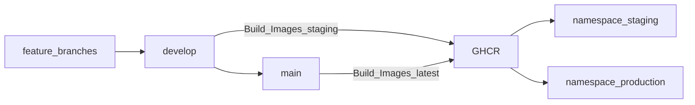

# Cullinos — Production Deployment (GitHub → GHCR → k3s)

All apps run on the OnLiveServer VM (`95.135.254.46`) under **k3s**. Images build in **GitHub Actions** and push to **GHCR**. Staging and production are separate namespaces on the same node.

Legacy Docker Compose + `scripts/remote-deploy.py` is **emergency-only**. See [CONTRIBUTING.md](../CONTRIBUTING.md) for the branch model.

## Architecture

| Component | How | Domain (prod) | Domain (staging) |
|-----------|-----|---------------|------------------|
| API + WebSocket | Deployment `api` | `api.cullinos.com` | `staging-api.cullinos.com` |
| Postgres + Redis | In-cluster PVC | internal | internal |
| Admin / Manage / Platform / App Ops | SPA images | `admin` / `manage` / `platform` / `app` | `staging-*` |
| POS / KDS | SPA images | `pos` / `kds` | `staging-*` |
| Guest / Waiter landings | SPA images | `guest` / `waiter` | `staging-*` |
| Marketing | `web` (Next.js) | `cullinos.com` | `staging.cullinos.com` |
| Grafana | monitoring ns | `grafana.cullinos.com` | — |

Manifests: [`infrastructure/k8s/`](../infrastructure/k8s/). Cutover: [`infrastructure/k8s/scripts/cutover-checklist.md`](../infrastructure/k8s/scripts/cutover-checklist.md).

**DNS (human):** add Cloudflare A records for `app.cullinos.com` and `staging-app.cullinos.com` pointing at the VM before first App Ops deploy.



## GitHub secrets & environments

Create environments **staging** and **production** (optional reviewers on production).

| Secret | Purpose |
|--------|---------|
| `KUBE_CONFIG` | Base64 of k3s kubeconfig (`server: https://95.135.254.46:6443`) |
| `STAGING_APP_SECRETS_ENV` | Multiline `KEY=value` for staging `cullinos-secrets` (see `infrastructure/k8s/secrets.example.env`) |
| `PRODUCTION_APP_SECRETS_ENV` | Same for production |
| `GHCR_PULL_TOKEN` | PAT with `read:packages` if default `GITHUB_TOKEN` cannot pull |
| `NEXT_PUBLIC_TURNSTILE_SITE_KEY` / `NEXT_PUBLIC_CF_WEB_ANALYTICS_TOKEN` | Baked into web/SPA builds |
| `SENTRY_DSN` | Optional; also include in `*_APP_SECRETS_ENV` |

Workflows:

| Workflow | Trigger | Action |
|----------|---------|--------|
| `CI` / `Security` | PR + push | Gates |
| `Build Images` | push `develop`/`main` | Push to `ghcr.io/ak2hay/cullinos-*` |
| `Deploy Staging` | after build on `develop` | Apply staging overlay |
| `Deploy Production` | after build on `main` | Apply production + Prisma push |
| `Uptime Check` | every 15m | Curl health URLs |
| `E2E Production` | nightly | Playwright against prod |

## First-time VM setup

```bash
# On VM as root
cd /opt/cullinos && git pull
bash infrastructure/k8s/scripts/install-k3s.sh
bash infrastructure/k8s/scripts/install-monitoring.sh
# Follow cutover-checklist.md (migrate DB, stop nginx/Compose)
```

DNS: point all prod and staging hostnames A → `95.135.254.46`. TLS via Traefik + Cloudflare (Full) or Traefik ACME.

## Manual kubectl deploy

```bash
export KUBECONFIG=/etc/rancher/k3s/k3s.yaml
kubectl apply -k infrastructure/k8s/overlays/staging
kubectl apply -k infrastructure/k8s/overlays/production
kubectl -n production rollout status deployment/api
```

## Build commit in `/health`

`GET /api/v1/health` reports `commit` from `GIT_COMMIT` (or `DEPLOY_COMMIT`); it shows `unknown` when neither is set.

- **Images (GHCR):** `build-images.yml` passes `GIT_COMMIT=${{ github.sha }}` as a Docker build arg.
- **Compose:** `scripts/remote-deploy.py`, `vm-redeploy-frontends-api.py` and `vm-selective-redeploy.py` read the local `git rev-parse` and run `GIT_COMMIT=<sha> docker compose -f docker-compose.prod.yml build api`. By hand:

  ```bash
  GIT_COMMIT=$(git rev-parse --short HEAD) docker compose -f docker-compose.prod.yml up -d --build api
  ```

After a deploy, check `curl -s https://api.cullinos.com/api/v1/health` returns the SHA you shipped.

## Rollback

- **App:** Actions → Deploy Production → `workflow_dispatch` with prior image SHA tag.
- **DB:** R2 restore — [BACKUP_ROLLBACK.md](BACKUP_ROLLBACK.md).
- **Cluster unavailable:** emergency Compose path via legacy `scripts/remote-deploy.py` (only if Compose stack still present).

## QR table ordering

1. Waiter opens **Cullinos Waiter** → table → **Show QR to customers**
2. Session QR: `https://guest.cullinos.com/{orgSlug}/{outletSlug}?session={token}`
3. Guests order into the shared table order; waiter ends session when cleared.

## Local development

```bash
cp .env.example .env
npm run docker:up
npm install
npm run db:generate && npm run db:push && npm run db:seed
npm run dev
```

Do not point local apps at production. See [CONTRIBUTING.md](../CONTRIBUTING.md).
