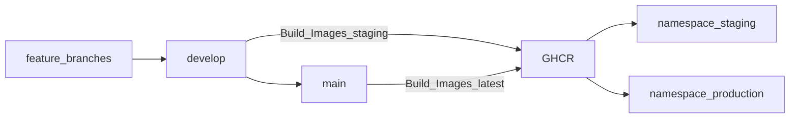

# Cullinos — Production Deployment (GitHub → GHCR → k3s)

All apps run on the OnLiveServer VM (`95.135.254.46`) under **k3s**. Images build in **GitHub Actions** and push to **GHCR**. Staging and production are separate namespaces on the same node.

Legacy Docker Compose + `scripts/remote-deploy.py` is **emergency-only**. See [CONTRIBUTING.md](../CONTRIBUTING.md) for the branch model.

## Architecture

| Component | How | Domain (prod) | Domain (staging) |
|-----------|-----|---------------|------------------|
| API + WebSocket | Deployment `api` | `api.cullinos.com` | `staging-api.cullinos.com` |
| Postgres + Redis | In-cluster PVC | internal | internal |
| Admin / Manage / Platform / App Ops | SPA images | `admin` / `manage` / `platform` / `app` | `staging-*` |
| POS / KDS | SPA images | `pos` / `kds` | `staging-*` |
| Guest / Waiter landings | SPA images | `guest` / `waiter` | `staging-*` |
| Marketing | `web` (Next.js) | `cullinos.com` | `staging.cullinos.com` |
| Grafana | monitoring ns | `grafana.cullinos.com` | — |

Manifests: [`infrastructure/k8s/`](../infrastructure/k8s/). Cutover: [`infrastructure/k8s/scripts/cutover-checklist.md`](../infrastructure/k8s/scripts/cutover-checklist.md).

**DNS (human):** add Cloudflare A records for `app.cullinos.com` and `staging-app.cullinos.com` pointing at the VM before first App Ops deploy.


```mermaid
flowchart LR
  feature[feature_branches] --> develop
  develop -->|Build_Images_staging| GHCR
  GHCR --> stagingNs[namespace_staging]
  develop --> main
  main -->|Build_Images_latest| GHCR
  GHCR --> prodNs[namespace_production]
```

## GitHub secrets & environments

Create environments **staging** and **production**. Add **required reviewers** on production:
the deploy job waits for approval before touching the cluster.

`KUBE_CONFIG` must be an **environment** secret (not a repository secret), holding a kubeconfig
for a ServiceAccount bound to that environment's namespace only, so a staging run cannot
touch production. Generate it on the node with
`bash infrastructure/k8s/scripts/create-deploy-kubeconfig.sh <production|staging>` (creates the
`github-deployer` ServiceAccount and Role, verifies the scope, writes `/root/kube-config-<ns>.b64`);
never use the admin `/etc/rancher/k3s/k3s.yaml`.

| Secret | Scope | Purpose |
|--------|-------|---------|
| `KUBE_CONFIG` | environment | Base64 kubeconfig, namespace-scoped ServiceAccount |
| `STAGING_APP_SECRETS_ENV` | staging | Multiline `KEY=value` for `cullinos-secrets` (see `infrastructure/k8s/secrets.example.env`; must include `REDIS_PASSWORD`, and `TURNSTILE_SECRET_KEY` in production) |
| `PRODUCTION_APP_SECRETS_ENV` | production | Same for production |
| `GHCR_PULL_TOKEN` | repo | PAT with `read:packages` if default `GITHUB_TOKEN` cannot pull |
| `NEXT_PUBLIC_TURNSTILE_SITE_KEY` / `NEXT_PUBLIC_CF_WEB_ANALYTICS_TOKEN` | repo | Baked into the web build |
| `VITE_TURNSTILE_SITE_KEY` | repo | Baked into SPA builds (forgot-password / login captcha) |
| `ANDROID_ASSETLINKS_SHA256` | repo | Comma-separated SHA-256 cert fingerprints (Play app signing + upload key) for `guest-landing/.well-known/assetlinks.json`; `main` (production) landing builds fail without it, staging builds keep the placeholder with a warning |
| `SENTRY_DSN` | env | Optional; also include in `*_APP_SECRETS_ENV` |

Workflows:

| Workflow | Trigger | Action |
|----------|---------|--------|
| `CI` | PR + push | `migrate deploy` + drift check, seed, lint, typecheck, build, tests, `flutter analyze`/`test`; on push to `develop`/`main` it then calls `Build Images` |
| `Security` | PR + push to `develop`/`main` + weekly | npm audit, CodeQL, gitleaks, Trivy |
| `Build Images` | called by `CI` after every job passes | Push `ghcr.io/ak2hay/cullinos-*:<short-sha>` (+ `staging`/`latest`) |
| `Deploy Staging` | `CI` success on push to `develop` | `scripts/k8s-deploy.sh`: infra, migration Job, roll out `<short-sha>`, smoke `/health/db`, auto-rollback |
| `Deploy Production` | `CI` success on push to `main` (production approval) | Same, for production |

Both deploy workflows are skipped unless the repo variable `K8S_DEPLOY_ENABLED` is `true`. Until the
k3s cutover (`infrastructure/k8s/scripts/cutover-checklist.md`) production runs on Docker Compose and is
deployed with `scripts/vm-selective-redeploy.py` (baseline/migrations: `scripts/vm-db-sync-schema.py`).
| `Uptime Check` | every 15m | Curl health URLs |
| `E2E Production` | nightly | Playwright against prod |

## First-time VM setup

```bash
# On VM as root
cd /opt/cullinos && git pull
bash infrastructure/k8s/scripts/install-k3s.sh
GRAFANA_ADMIN_PASSWORD='<16+ random chars>' bash infrastructure/k8s/scripts/install-monitoring.sh
# Follow cutover-checklist.md (migrate DB, stop nginx/Compose)
```

DNS: point all prod and staging hostnames A → `95.135.254.46`. TLS via Traefik + Cloudflare (Full) or Traefik ACME.

## Manual kubectl deploy

Use the same script as CI so migrations run before the rollout and images are pinned to a SHA:

```bash
export KUBECONFIG=/etc/rancher/k3s/k3s.yaml
bash scripts/k8s-deploy.sh staging infrastructure/k8s/overlays/staging <short-sha>
bash scripts/k8s-deploy.sh production infrastructure/k8s/overlays/production <short-sha>
```

Avoid bare `kubectl apply -k`: the overlays reference `:latest`/`:staging` and would skip migrations.

## Cluster hardening

- NetworkPolicy (`infrastructure/k8s/base/network-policy.yaml`) denies ingress by default; only
  Traefik (kube-system) reaches app pods, `monitoring` scrapes the API, and only the API,
  migration and backup pods reach Postgres/Redis. k3s enforces NetworkPolicy out of the box.
- Redis requires `REDIS_PASSWORD`; the API builds `REDIS_URL` from it.
- API runs 2 replicas with a PodDisruptionBudget; SPAs run `nginx-unprivileged` on :8080.
- TLS: use Cloudflare **Full (strict)** with a Cloudflare origin certificate (or cert-manager)
  in Traefik; plain "Full" accepts any certificate at the origin.

## Backups

`infrastructure/k8s/overlays/production/backup-cronjob.yaml` runs nightly at 02:00 IST:
`pg_dump -Fc` → AES-256 (`openssl`, PBKDF2) → R2 under `production/YYYY/MM/DD/`. Create the
`cullinos-backup` secret first (keys listed in `infrastructure/k8s/secrets.example.env`) and set
an R2 lifecycle rule for retention. Keep `BACKUP_ENCRYPTION_KEY` in the password manager as
well: without it the backups cannot be restored.

Run a restore drill at least quarterly into a scratch database (command in the CronJob header)
and record the result in [BACKUP_ROLLBACK.md](BACKUP_ROLLBACK.md). Trigger an ad-hoc backup with
`kubectl -n production create job --from=cronjob/db-backup db-backup-manual-$(date +%s)`.

## Build commit in `/health`

`GET /api/v1/health` reports `commit` from `GIT_COMMIT` (or `DEPLOY_COMMIT`); it shows `unknown` when neither is set.

- **Images (GHCR):** `build-images.yml` passes `GIT_COMMIT=${{ github.sha }}` as a Docker build arg.
- **Compose:** `scripts/remote-deploy.py`, `vm-redeploy-frontends-api.py` and `vm-selective-redeploy.py` read the local `git rev-parse` and run `GIT_COMMIT=<sha> docker compose -f docker-compose.prod.yml build api`. By hand:

  ```bash
  GIT_COMMIT=$(git rev-parse --short HEAD) docker compose -f docker-compose.prod.yml up -d --build api
  ```

After a deploy, check `curl -s https://api.cullinos.com/api/v1/health` returns the SHA you shipped.

## Database migrations

Schema changes ship as Prisma migrations in `packages/prisma/prisma/migrations` and are applied
with `prisma migrate deploy` by the `db-migrate` Kubernetes Job before each rollout. `db push`
is for local development only; `--accept-data-loss` / `--force-reset` are not used anywhere.

New change: edit `schema.prisma`, then `npm run db:migrate -- --name <change>` locally and commit
the generated folder.

**Baselining an existing database (one time, human-run).** `0_init` is the full schema. Databases
that were created with `db push` must be caught up and marked as baselined instead of running it:

For a Compose VM, `DEPLOY_HOST=<ip> python scripts/vm-db-sync-schema.py` automates steps 2–6
with confirmations. On k3s run them from a shell in an API pod.

1. Back up (`infrastructure/k8s/scripts/backup-pg-k8s.sh`).
2. Run `packages/prisma/prisma/baseline/precheck.sql`; every query must return no rows.
3. Generate and review the catch-up SQL. Target the frozen `0_init` schema, not `schema.prisma`,
   so the later migrations (and their data steps, e.g. `platform_role = 'owner'` for existing
   super admins) still run in step 6:
   `npx prisma migrate diff --from-url "$DATABASE_URL" --to-schema-datamodel packages/prisma/prisma/baseline/schema-0_init.prisma --script > catchup.sql`
4. Apply it: `npx prisma db execute --url "$DATABASE_URL" --file catchup.sql`, then run the backfills
   at the bottom of `precheck.sql`.
5. `npx prisma migrate resolve --applied 0_init --schema packages/prisma/prisma/schema.prisma`
6. `node packages/prisma/scripts/migrate-deploy.mjs` applies the migrations after `0_init`;
   `npx prisma migrate status` must then report the database is up to date.

The migration Job refuses to run on a database that has tables but no `0_init` record.

## Rollback

- **App:** Actions → Deploy Production → `workflow_dispatch` with prior image SHA tag.
  A failed smoke check rolls the deployments back automatically.
- **DB:** R2 restore — [BACKUP_ROLLBACK.md](BACKUP_ROLLBACK.md).
- **Cluster unavailable:** emergency Compose path via legacy `scripts/remote-deploy.py` (only if Compose stack still present).

## QR table ordering

1. Waiter opens **Cullinos Waiter** → table → **Show QR to customers**
2. Session QR: `https://guest.cullinos.com/{orgSlug}/{outletSlug}?session={token}`
3. Guests order into the shared table order; waiter ends session when cleared.

## Local development

```bash
cp .env.example .env
npm run docker:up
npm install
npm run db:generate && npm run db:migrate:deploy && npm run db:seed
npm run dev
```

Do not point local apps at production. See [CONTRIBUTING.md](../CONTRIBUTING.md).
