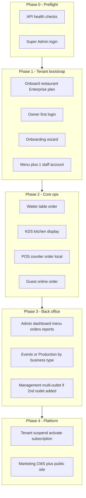
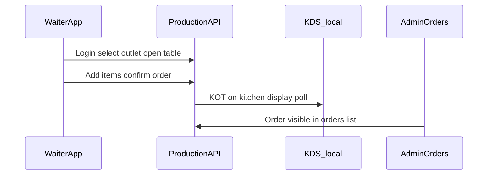

# Cullinos Production Manual Test Plan

Full functionality manual QA for production, starting from a **fresh tenant** onboarded via Super Admin.

**Environment:** Production  
**Tenant:** New restaurant (Enterprise plan)  
**Staff:** 1 employee (Waiter role)

---

## Table of contents

1. [Overview](#overview)
2. [Phase 0 — Preflight](#phase-0--preflight)
3. [Phase 1 — Tenant bootstrap](#phase-1--tenant-bootstrap)
4. [Phase 2 — Core operational workflows](#phase-2--core-operational-workflows)
5. [Phase 3 — Admin back office](#phase-3--admin-back-office)
6. [Phase 4 — Enterprise Management](#phase-4--enterprise-management)
7. [Phase 5 — Super Admin platform ops](#phase-5--super-admin-platform-ops)
8. [Phase 6 — Marketing website](#phase-6--marketing-website)
9. [Phase 7 — API-only modules (Swagger)](#phase-7--api-only-modules-swagger)
10. [Out of scope / expected N/A items](#out-of-scope--expected-na-items)

---

## Overview

### Test approach

One QA lead switches between roles (Super Admin, Owner, Guest) while one employee tests floor operations (Waiter). Record all credentials in [CREDENTIALS_LOG.md](./CREDENTIALS_LOG.md), defects in [BUG_LOG.md](./BUG_LOG.md), and results in [TEST_RUN_SHEET.md](./TEST_RUN_SHEET.md).

### Production constraints

| Constraint | Impact |
|------------|--------|
| POS / KDS not on Vercel | Run locally against prod API, or mark POS/KDS cases Blocked/N/A |
| Admin Tables & Inventory | Placeholder UI — test tables via Waiter; inventory via Swagger |
| API-only modules | No dedicated UI — verify via Swagger |
| Razorpay pay-now | N/A unless production keys configured |

### Phase flow

---

## Phase 0 — Preflight

**Goal:** Confirm production is healthy and tooling is ready.

### Production URLs

| App | URL |
|-----|-----|
| API health | https://api.cullinos.com/api/v1/health |
| API DB health | https://api.cullinos.com/api/v1/health/db |
| Swagger | https://api.cullinos.com/docs |
| Super Admin | https://platform.cullinos.com |
| Admin | https://admin.cullinos.com |
| Management | https://manage.cullinos.com |
| Waiter | https://waiter.cullinos.com |
| Customer storefront | https://order.cullinos.com/{orgSlug}/{outletSlug} |
| Marketing | https://cullinos.com |

### Steps

1. Open API health URL in browser — expect JSON with healthy status.
2. Open API DB health URL — expect database connectivity OK.
3. Login to Super Admin — confirm dashboard loads.
4. Prepare run folder: `docs/qa/runs/RUN-YYYYMMDD/` with copied templates.
5. Prepare two browsers (main + incognito).
6. Optional: start local POS/KDS with `VITE_API_URL=https://api.cullinos.com/api/v1`.

### Naming convention (fresh tenant)

| Field | Example |
|-------|---------|
| Restaurant name | QA Test Kitchen |
| Owner email | qa-owner+20260830@yourdomain.com |
| Staff email | qa-waiter+20260830@yourdomain.com |
| Plan | enterprise |

---

## Phase 1 — Tenant bootstrap

**Goal:** Create a new restaurant tenant and minimum test data.

### 1.1 Super Admin — Onboard restaurant

**App:** https://platform.cullinos.com  
**Route:** `/` (Tenants)

**Steps:**

1. Login with Super Admin credentials.
2. Click **Onboard restaurant**.
3. Fill the form:
   - Restaurant name (e.g. QA Test Kitchen)
   - First outlet name (e.g. Main Outlet)
   - Plan: **enterprise**
   - Owner name, email, password
4. Submit and copy the success message (owner email + Admin URL).
5. Record org slug, outlet slug, and credentials in Credentials Log.
6. Verify new tenant appears in list with **active** status.

**Expected:**

- Tenant created with default outlet and subscription.
- Owner can log in at https://admin.cullinos.com.

### 1.2 Owner — First login and onboarding wizard

**App:** https://admin.cullinos.com  
**Route:** `/onboarding`

**Steps:**

1. Login with owner credentials from onboarding.
2. Navigate to **Setup** (`/onboarding`) if not redirected automatically.
3. Select business type: **restaurant** (full-service, includes tables step).
4. Complete wizard steps:
   - **Business info:** name, GSTIN (test: `27AAAAA0000A1Z5`)
   - **Menu setup:** note recommended categories
   - **Tables:** follow wizard guidance
   - **Tax & GST:** follow wizard guidance
   - **Staff:** follow wizard guidance
   - **Done:** reach completion step
5. Record business type and operating mode in Credentials Log.

**Expected:**

- Wizard saves settings without error.
- Owner lands on Done step.

### 1.3 Owner — Seed minimum test data

| Area | Route | Minimum data |
|------|-------|--------------|
| Menu | `/menu` | 2 categories, 4+ items (mix veg/non-veg, varied prices) |
| Staff | `/staff` | 1 employee — role **Waiter**, assigned to main outlet |
| Settings | `/settings` | Confirm businessType, operatingMode, enabledOrderTypes |
| 2nd outlet (optional) | Swagger | Add second outlet for Management stock transfer tests |

**Staff creation steps:**

1. Admin → Staff → **Add staff member**
2. Name, email, password, role: Waiter
3. Assign main outlet
4. Submit — record credentials in Credentials Log (password ref only)

**Optional (local POS only):**

- Create second staff account with role **Cashier** for POS testing.

---

## Phase 2 — Core operational workflows

**Goal:** Verify end-to-end order flows across customer-facing and staff apps.

Record order IDs, timestamps, and screenshots on failure in Bug Log.

### 2.1 Dine-in: Waiter → Kitchen (KDS)

**Apps:** Waiter, KDS (local), Admin

| Step | Action | Expected |
|------|--------|----------|
| 1 | Employee logs into https://waiter.cullinos.com | Login succeeds |
| 2 | Select main outlet | Outlet loads; table grid visible |
| 3 | Open a table → `/order/:tableId` | Menu items load |
| 4 | Add 2+ items, confirm order | Success message; order number shown |
| 5 | Open KDS locally: `http://localhost:5174?outletId=<id>` | KOT card appears within ~5s |
| 6 | Admin → `/orders` | Order listed with correct status, source, total |

**Table data gap:** If no tables exist, create via Swagger `POST /api/v1/tables` (Admin Tables UI is placeholder). Document in Bug Log if blocked.

### 2.2 Counter / takeaway: POS (local only)

**App:** POS on localhost:5173 (against prod API)

| Step | Action | Expected |
|------|--------|----------|
| 1 | Login as Cashier | POS loads with outlet |
| 2 | Browse menu, add items, set takeaway | Cart subtotal correct |
| 3 | Hold order | Order appears in held panel |
| 4 | Resume held order | Cart restores |
| 5 | Checkout (quick order) | Order confirmed |

Mark **Blocked** if local POS not available.

### 2.3 Guest online ordering: Customer app

**URL:** `https://order.cullinos.com/{orgSlug}/{outletSlug}`

| Step | Action | Expected |
|------|--------|----------|
| 1 | Open storefront in incognito | Menu categories and items from Phase 1 |
| 2 | Add items (with modifiers if available) | Cart badge updates |
| 3 | Go to cart | Items and totals correct |
| 4 | Checkout — enter name, phone | Form validates |
| 5 | Optional: scheduled pickup, tip | Fields accept input |
| 6 | Pay later (default) | Order placed; confirmation shown |
| 7 | Admin → `/orders` | Online/QR source order visible |
| 8 | Retry with `?table=T1` query param | Table binding on order (if table exists) |

**Pay now (Razorpay):** Test only if keys configured; otherwise N/A.

### 2.4 Pickup queue (cafe/QSR path)

For counter/cafe business types, or after switching operating mode in Settings:

| Step | Action | Expected |
|------|--------|----------|
| 1 | Admin → `/pickup-queue` | Page loads with KDS pickup URL |
| 2 | Copy URL, open in browser/KDS | Pickup display loads |
| 3 | Place counter/online order | Order appears in Preparing column |
| 4 | Mark ready (via API or KDS action) | Order moves to Ready column |

For restaurant-only setup, mark N/A or retest after changing business type.

---

## Phase 3 — Admin back office

**App:** https://admin.cullinos.com  
**Role:** Owner

Test each module after Phase 2 orders exist (for meaningful dashboard/reports data).

| Module | Route | Test focus | Known limit |
|--------|-------|------------|-------------|
| Dashboard | `/` | KPIs: revenue, orders, AOV, payment breakdown | Numbers reflect test orders |
| Menu | `/menu` | Create/edit category; create/edit item; price change | Changes visible on Waiter/Customer |
| Orders | `/orders` | List all test orders; check status, source, total | All Phase 2 orders present |
| Tables | `/tables` | Page loads | **Phase 2 placeholder** — not a bug |
| Inventory | `/inventory` | Page loads | **Phase 2 placeholder** — not a bug |
| Customers | `/customers` | Loyalty tiers list; coupons list | Read-only display OK |
| Events | `/events` | Create event: location, date, pre-order window | Event saves and lists |
| Production | `/production` | Schedule batch; complete batch | May be empty for restaurant type |
| Pickup Queue | `/pickup-queue` | Copy KDS URL | URL includes correct outletId |
| Staff | `/staff` | Employee listed; form validation | 1 waiter visible |
| Reports | `/reports` | Revenue, top items, peak hours | Non-zero after test orders |
| Settings | `/settings` | Edit JSON, save valid config | Invalid JSON shows error |
| Onboarding | `/onboarding` | Revisit wizard | Steps reflect business type |
| Login | `/login` | Logout and re-login | Session persists correctly |

---

## Phase 4 — Enterprise Management

**App:** https://manage.cullinos.com  
**Role:** Owner  
**Requires:** Enterprise plan (set during onboarding)

| Module | Route | Test focus | Blocked if |
|--------|-------|------------|------------|
| Overview | `/` | Consolidated KPIs, payment mix, hourly breakdown | — |
| Reports | `/reports` | Network-level report loads | — |
| Outlet Comparison | `/comparison` | Cross-outlet metrics | Only 1 outlet |
| Stock Transfer | `/stock-transfer` | Create transfer between outlets | Only 1 outlet |
| Franchise | `/franchise` | Franchisee list | May be empty on fresh tenant |

**If only one outlet:** Add second outlet via Swagger, then retest comparison and stock transfer.

---

## Phase 5 — Super Admin platform ops

**App:** https://platform.cullinos.com  
**Role:** Super Admin  
**Safety:** Use QA tenant only for destructive actions.

| Module | Route | Test focus |
|--------|-------|------------|
| Tenants | `/` | Find QA tenant in list |
| Onboard | modal | Completed in Phase 1 — verify tenant details |
| Subscriptions | `/subscriptions` | Change plan for QA tenant; verify entitlements |
| System Health | `/health` | Platform metrics load (orgs, orders, sync) |
| Marketing CMS | `/marketing` | Dashboard loads |
| Hero editor | `/marketing/hero` | Edit and save draft |
| Pages editor | `/marketing/pages` | Edit page content |
| Theme editor | `/marketing/theme` | View/edit theme tokens |
| Pricing editor | `/marketing/pricing` | View/edit pricing tiers |
| Navigation editor | `/marketing/navigation` | View/edit nav links |
| Blog editor | `/marketing/blog` | Create/edit draft post |
| Media library | `/marketing/media` | Upload or list media |
| Design lab | `/marketing/design-lab` | Page loads |

### Destructive tests (QA tenant only)

1. **Suspend tenant** — provide reason, confirm owner cannot login to Admin.
2. **Reactivate tenant** — confirm owner can login again.
3. Document any unexpected behavior in Bug Log.

**Do not** publish breaking marketing CMS changes to production without approval.

---

## Phase 6 — Marketing website

**App:** https://cullinos.com (public, no login)

| Page | Path | Check |
|------|------|-------|
| Home | `/` | Hero, CTAs, navigation |
| Features | `/features` | Content renders |
| Pricing | `/pricing` | Plans/pricing visible |
| Integrations | `/integrations` | Page loads |
| About | `/about` | Page loads |
| Blog index | `/blog` | Post list loads |
| Blog article | `/blog/[slug]` | At least one article readable |
| Contact | `/contact` | Form submits or graceful error without Resend |
| Privacy | `/privacy` | Legal content |
| Terms | `/terms` | Legal content |
| Solutions — Restaurants | `/solutions/restaurants` | Vertical page loads |
| Solutions — Cafes | `/solutions/cafes` | Vertical page loads |
| Solutions — Food trucks | `/solutions/food-trucks` | Vertical page loads |
| Solutions — Bakeries | `/solutions/bakeries` | Vertical page loads |
| Solutions — Chains | `/solutions/chains` | Vertical page loads |
| Solutions — Hospitality | `/solutions/hospitality` | Vertical page loads |

**CMS cross-check:** If Super Admin marketing edits were saved, verify they appear on the public site after revalidation (if configured).

---

## Phase 7 — API-only modules (Swagger)

**Tool:** https://api.cullinos.com/docs  
**Auth:** Owner JWT from browser DevTools (Network tab after Admin login) or `POST /api/v1/auth/login`.

| Module | API prefix | Smoke test |
|--------|------------|------------|
| Billing | `/billing` | List invoices for a test order |
| KOT | `/kot` | List kitchen tickets for outlet |
| Tax | `/tax` | Get tax configuration |
| Recipes | `/recipes` | Create and list one recipe |
| Purchasing | `/purchasing` | Create purchase order draft |
| Wastage | `/wastage` | Log one wastage entry |
| Delivery | `/delivery` | List delivery orders |
| Hospitality | `/hospitality` | Create guest and room (Enterprise) |
| Audit | `/audit` | Recent entries after admin actions |
| Notifications | `/notifications` | List notifications |
| Devices | `/devices` | List registered devices |
| Integrations | `/integrations` | List integrations |
| Insights | `/insights` | Fetch insights payload |
| Sync | `/sync` | Document only — requires Gateway token |

Record HTTP status and response shape in TEST_RUN_SHEET notes column.

---

## Out of scope / expected N/A items

Document these as **Known limitations**, not defects:

| Item | Reason |
|------|--------|
| Admin Tables UI | Phase 2 placeholder — use Waiter + Swagger |
| Admin Inventory UI | Phase 2 placeholder — use Swagger |
| POS/KDS on production Vercel | Local/Gateway apps only |
| Razorpay pay-now | Requires production payment keys |
| Gateway offline sync | Requires Electron app on outlet LAN |
| Frontend route permissions | UI checks auth token only, not per-route RBAC |
| Staff password reset in UI | May not exist — note if missing |

---

## Sign-off criteria

A run is **complete** when:

- [ ] All TEST_RUN_SHEET cases marked Pass, Fail, Blocked, or N/A
- [ ] Credentials Log filled (references only, no plaintext passwords in git)
- [ ] All Fail/Blocked cases have Bug Log entries
- [ ] Known limitations documented separately from open bugs
- [ ] Sign-off block completed in TEST_RUN_SHEET
