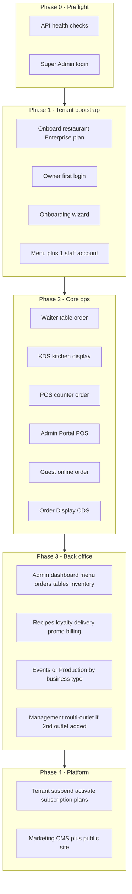
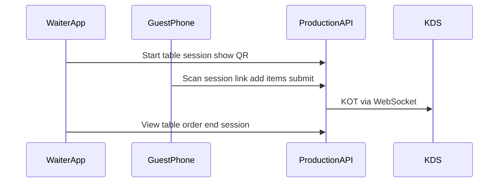

# Cullinos Production Manual Test Plan

Full functionality manual QA for production, starting from a **fresh tenant** onboarded via Super Admin.

**Environment:** Production  
**Tenant:** New restaurant (Enterprise plan)  
**Staff:** 1 employee (Waiter role)

**Exhaustive click-paths:** [COMPLETE_FEATURE_TEST_GUIDE.md](./COMPLETE_FEATURE_TEST_GUIDE.md) · **Score sheet:** [TEST_RUN_SHEET.md](../sheets/TEST_RUN_SHEET.md) (**190** cases)

---

## Table of contents

1. [Overview](#overview)
2. [Phase 0 — Preflight](#phase-0--preflight)
3. [Phase 1 — Tenant bootstrap](#phase-1--tenant-bootstrap)
4. [Phase 2 — Core operational workflows](#phase-2--core-operational-workflows)
5. [Phase 3 — Admin back office](#phase-3--admin-back-office)
6. [Phase 4 — Enterprise Management](#phase-4--enterprise-management)
7. [Phase 5 — Super Admin platform ops](#phase-5--super-admin-platform-ops)
8. [Phase 6 — Marketing website](#phase-6--marketing-website)
9. [Phase 7 — API smoke (Swagger)](#phase-7--api-smoke-swagger)
10. [Out of scope / expected N/A items](#out-of-scope--expected-na-items)

---

## Overview

### Test approach

One QA lead switches between roles (Super Admin, Owner, Guest) while one employee tests floor operations (Waiter). Record all credentials in [CREDENTIALS_LOG.md](../sheets/CREDENTIALS_LOG.md), defects in [BUG_LOG.md](../sheets/BUG_LOG.md), and results in [TEST_RUN_SHEET.md](../sheets/TEST_RUN_SHEET.md).

### Production constraints

| Constraint | Impact |
|------------|--------|
| POS / KDS hosted | https://pos.cullinos.com and https://kds.cullinos.com |
| Admin Portal POS | https://admin.cullinos.com/pos (requires POS_ACCESS) |
| Business-type nav | Banquets / Brands / Guests / Rooms may be hidden on restaurant → N/A |
| Razorpay pay-now | N/A unless production keys configured |

### Phase flow

---

## Phase 0 — Preflight

**Goal:** Confirm production is healthy and tooling is ready.

### Production URLs

| App | URL |
|-----|-----|
| API health | https://api.cullinos.com/api/v1/health |
| API DB health | https://api.cullinos.com/api/v1/health/db |
| Swagger | https://api.cullinos.com/docs |
| Super Admin | https://platform.cullinos.com |
| Admin | https://admin.cullinos.com |
| Management | https://manage.cullinos.com |
| Waiter | Cullinos Waiter Android app |
| Cullinos App | https://guest.cullinos.com/{orgSlug}/{outletSlug} |
| Marketing | https://cullinos.com |

### Steps

1. Open API health URL in browser — expect JSON with healthy status.
2. Open API DB health URL — expect database connectivity OK.
3. Login to Super Admin — confirm dashboard loads.
4. Prepare run folder: `docs/qa/runs/RUN-YYYYMMDD/` with copied templates.
5. Prepare two browsers (main + incognito).
6. Optional: start local POS/KDS with `VITE_API_URL=https://api.cullinos.com/api/v1`.

### Naming convention (fresh tenant)

| Field | Example |
|-------|---------|
| Restaurant name | QA Test Kitchen |
| Owner email | qa-owner+20260830@yourdomain.com |
| Staff email | qa-waiter+20260830@yourdomain.com |
| Plan | enterprise |

---

## Phase 1 — Tenant bootstrap

**Goal:** Create a new restaurant tenant and minimum test data.

### 1.1 Super Admin — Onboard restaurant

**App:** https://platform.cullinos.com  
**Route:** `/` (Tenants)

**Steps:**

1. Login with Super Admin credentials.
2. Click **Onboard restaurant**.
3. Fill the form:
   - Restaurant name (e.g. QA Test Kitchen)
   - First outlet name (e.g. Main Outlet)
   - Plan: **enterprise**
   - Owner name, email, password
4. Submit and copy the success message (owner email + Admin URL).
5. Record org slug, outlet slug, and credentials in Credentials Log.
6. Verify new tenant appears in list with **active** status.

**Expected:**

- Tenant created with default outlet and subscription.
- Owner can log in at https://admin.cullinos.com.

### 1.2 Owner — First login and onboarding wizard

**App:** https://admin.cullinos.com  
**Route:** `/onboarding`

**Steps:**

1. Login with owner credentials from onboarding.
2. Navigate to **Setup** (`/onboarding`) if not redirected automatically.
3. Select business type: **restaurant** (full-service, includes tables step).
4. Complete wizard steps:
   - **Business info:** name, GSTIN (test: `27AAAAA0000A1Z5`)
   - **Menu setup:** note recommended categories
   - **Tables:** follow wizard guidance
   - **Tax & GST:** follow wizard guidance
   - **Staff:** follow wizard guidance
   - **Done:** reach completion step
5. Record business type and operating mode in Credentials Log.

**Expected:**

- Wizard saves settings without error.
- Owner lands on Done step.

### 1.3 Owner — Seed minimum test data

| Area | Route | Minimum data |
|------|-------|--------------|
| Menu | `/menu` | 2 categories, 4+ items (mix veg/non-veg, varied prices) |
| Tables | `/tables` | 2+ tables (e.g. T1, T2) via Admin UI |
| Staff | `/staff` | 1 **Waiter** + 1 **Cashier** (for POS), assigned to main outlet |
| Settings | `/settings` | Confirm businessType, operatingMode, enabledOrderTypes |
| 2nd outlet (optional) | Swagger | Add second outlet for Management stock transfer tests |

**Staff creation steps:**

1. Admin → Staff → **Add staff member**
2. Name, email, password, role: Waiter
3. Assign main outlet
4. Submit — record credentials in Credentials Log (password ref only)
5. Repeat for **Cashier** (POS at pos.cullinos.com and Admin `/pos`)

**Auth recovery (Phase 1.4):**

- Admin `/forgot-password` and Super Admin `/forgot-password` — page loads, accepts email (do not need to complete mailbox delivery)
- Owner `/change-password` — page reachable after login

---

## Phase 2 — Core operational workflows

**Goal:** Verify end-to-end order flows across customer-facing and staff apps.

Record order IDs, timestamps, and screenshots on failure in Bug Log.

### 2.1 Dine-in: Waiter order + QR guest ordering → KDS

**Apps:** Waiter, Customer (session QR), KDS (`https://kds.cullinos.com`), Admin

| Step | Action | Expected |
|------|--------|----------|
| 1 | Employee logs into Cullinos Waiter Android app | Login succeeds |
| 2 | Select main outlet | Table grid visible |
| 3 | Tap table → **Show QR to customers** | QR modal with session link |
| 4 | Open QR link on phone (incognito) | Menu loads; “Ordering for Table …” |
| 5 | Guest adds items → checkout | Order sent to kitchen |
| 6 | Waiter **View table order** | Same order shows guest items |
| 7 | Open https://kds.cullinos.com (kitchen login) | KOT card appears |
| 8 | Waiter **End session** | Guest link shows expired on refresh |
| 9 | Alt: **Take order on waiter app** | Waiter adds items directly (same table order) |

### 2.2 Counter / takeaway: POS

**App:** https://pos.cullinos.com

| Step | Action | Expected |
|------|--------|----------|
| 1 | Open POS URL, login as Cashier | POS loads with outlet |
| 2 | Browse menu, add items, set takeaway | Cart subtotal correct |
| 3 | Hold order | Order appears in held panel |
| 4 | Resume held order | Cart restores |
| 5 | Checkout (quick order) | Order confirmed |

### 2.3 Guest online ordering: Customer app

**URL:** `https://guest.cullinos.com/{orgSlug}/{outletSlug}`

| Step | Action | Expected |
|------|--------|----------|
| 1 | Open storefront in incognito | Menu categories and items from Phase 1 |
| 2 | Add items (with modifiers if available) | Cart badge updates |
| 3 | Go to cart | Items and totals correct |
| 4 | Checkout — enter name, phone | Form validates |
| 5 | Optional: scheduled pickup, tip | Fields accept input |
| 6 | Pay later (default) | Order placed; confirmation shown |
| 7 | Admin → `/orders` | Online/QR source order visible |
| 8 | Session QR flow (waiter generates QR, guest orders) | Items merge into table order; KOT on KDS |
| 9 | Open customer login modal | Modal opens; guest can still checkout without login |

**Pay now (Razorpay):** Test only if keys configured; otherwise N/A.

### 2.4 Displays hub & Order Display (CDS)

**Admin route:** `/displays` (legacy `/cds`, `/pickup-queue`, `/kds`, `/promo-display` redirect here)

| Step | Action | Expected |
|------|--------|----------|
| 1 | Admin → Displays (`/displays`) | Page loads with KDS / CDS / Pickup / Promo URLs |
| 2 | Copy CDS or Pickup URL and open | Public board loads without staff login |
| 3 | Place counter/online order | Appears in Preparing |
| 4 | Mark ready on KDS | Moves to Ready column |

### 2.5 Admin Portal POS

**App:** https://admin.cullinos.com/pos (owner or staff with `POS_ACCESS`)

| Step | Action | Expected |
|------|--------|----------|
| 1 | Open `/pos` as owner | Portal POS loads |
| 2 | Add items, hold, resume | Cart restores from held panel |
| 3 | Checkout | Order confirmed and listed in Admin Orders |

### 2.6 Digital Ordering (kiosk) launcher

| Step | Action | Expected |
|------|--------|----------|
| 1 | Admin → `/kiosk` | Launcher page loads |
| 2 | Copy / open storefront or kiosk URL | Storefront usable |

---

## Phase 3 — Admin back office

**App:** https://admin.cullinos.com  
**Role:** Owner  
**Detail steps:** [COMPLETE_FEATURE_TEST_GUIDE.md](./COMPLETE_FEATURE_TEST_GUIDE.md)

Test each module after Phase 2 orders exist (for meaningful dashboard/reports data).

| Module | Route | Test focus | Notes |
|--------|-------|------------|-------|
| Dashboard | `/` | KPIs: revenue, orders, AOV, payment breakdown | Numbers reflect test orders |
| Menu | `/menu` | Categories, items, combos, schedules, outlet prices | Changes visible on Waiter/Guest |
| Orders | `/orders` | List all test orders; check status, source, total | All Phase 2 orders present |
| Tables | `/tables` | Create/edit tables; QR | Real UI |
| Reservations | `/reservations` | Create reservation; copy book link | TABLES feature |
| Inventory | `/inventory` | List stock; add or adjust item | Real UI |
| Customers | `/customers` | Create / search; stamps | |
| Loyalty | `/loyalty` | Settings, tiers, rewards | Size-gated |
| Coupons | `/coupons` | Create / deactivate | |
| Recipes | `/recipes` | Create recipe; appears in list | |
| Purchasing / Suppliers | `/purchasing`, `/suppliers` | Draft PO; add supplier | |
| Central kitchen | `/central-kitchen` | Hub / indent | Often N/A |
| Delivery | `/delivery` | Add zone / list | May be empty |
| Aggregators | `/aggregators` | Swiggy/Zomato tabs | N/A without credentials |
| Payments | `/payments` | Razorpay / Cashfree Save | N/A without keys |
| App listing / Banners / SMS | `/marketplace`, `/guest-banners`, `/sms-campaigns` | Cullinos App marketing | |
| Billing | `/billing` | Page loads | Subscription / invoices |
| Events | `/events` | Create event | |
| Production | `/production` | Schedule / complete batch | May be N/A |
| Displays | `/displays` | Copy KDS / CDS / Pickup / Promo URLs | Unified hub |
| Digital Ordering | `/kiosk` | Launcher shows storefront URL | |
| Banquets | `/banquets` | Page loads | **N/A** on restaurant tenant |
| Brands | `/brands` | Page loads | **N/A** on restaurant tenant |
| Guests | `/hospitality/guests` | Page loads | **N/A** on restaurant tenant |
| Rooms | `/hospitality/rooms` | Page loads | **N/A** on restaurant tenant |
| Staff | `/staff` | Employees listed; Waiter without POS denied `/pos` | |
| Reports | `/reports` | Revenue, tabs, Export | Non-zero after test orders |
| Settings | `/settings` | Form Save; location / tax / device | Not a JSON editor |
| Onboarding | `/onboarding` | Revisit wizard; Complete setup seeds categories | |
| Login | `/login` | Logout and re-login | Session persists correctly |

**Note:** Promo Email is Super Admin `/promo-email` only — not an Admin route.

## Phase 4 — Enterprise Management

**App:** https://manage.cullinos.com  
**Role:** Owner  
**Requires:** Enterprise plan (set during onboarding)

| Module | Route | Test focus | Blocked if |
|--------|-------|------------|------------|
| Overview | `/` | Consolidated KPIs, payment mix, hourly breakdown | — |
| Reports | `/reports` | Network-level report loads | — |
| Outlet Comparison | `/comparison` | Cross-outlet metrics | Only 1 outlet |
| Stock Transfer | `/stock-transfer` | Create transfer between outlets | Only 1 outlet |
| Franchise | `/franchise` | Franchisee list | May be empty on fresh tenant |

**If only one outlet:** Add second outlet via Swagger, then retest comparison and stock transfer.

---

## Phase 5 — Super Admin platform ops

**App:** https://platform.cullinos.com  
**Role:** Super Admin  
**Safety:** Use QA tenant only for destructive actions.

| Module | Route | Test focus |
|--------|-------|------------|
| Tenants | `/` | Find QA tenant in list |
| Onboard | modal | Completed in Phase 1 — verify tenant details |
| Plans | `/plans` | Plans list / editor loads |
| Subscriptions | `/subscriptions` | Change plan for QA tenant; verify entitlements |
| Promo Email | `/promo-email` | Page loads |
| Guest App Ops overview | `/guest-ops` | KPIs load; maintenance alert if set |
| Marketplace | `/guest-ops/marketplace` | List outlets; toggle featured / unlist |
| Discover CMS | `/guest-ops/discover` | Create a section; appears in Guest Discover after refresh |
| Banners | `/guest-ops/banners` | Create platform banner; deactivate org banner |
| Push | `/guest-ops/push` | Draft + send (or schedule) campaign |
| Offers | `/guest-ops/offers` | Create coupon; toggle marketplace featured |
| Reviews | `/guest-ops/reviews` | Hide / restore a review |
| Guest users | `/guest-ops/users` | Search user; open detail; export JSON |
| Analytics | `/guest-ops/analytics` | Summary cards load |
| Runtime | `/guest-ops/runtime` | Save soft-update message; preview app-config |
| Settings | `/settings` | Platform settings page loads |
| System Health | `/health` | Platform metrics load (orgs, orders, sync) |
| Forgot password | `/forgot-password` | Page loads (logged out) |
| Marketing CMS | `/marketing` | Dashboard loads |
| Hero editor | `/marketing/hero` | Edit and save draft |
| Pages editor | `/marketing/pages` | Edit page content |
| Theme editor | `/marketing/theme` | View/edit theme tokens |
| Pricing editor | `/marketing/pricing` | View/edit pricing tiers |
| Navigation editor | `/marketing/navigation` | View/edit nav links |
| Testimonials | `/marketing/testimonials` | Editor loads |
| Blog editor | `/marketing/blog` | Create/edit draft post |
| Media library | `/marketing/media` | Upload or list media |
| Design lab | `/marketing/design-lab` | Page loads |

### Destructive tests (QA tenant only)

1. **Suspend tenant** — provide reason, confirm owner cannot login to Admin.
2. **Reactivate tenant** — confirm owner can login again.
3. Document any unexpected behavior in Bug Log.

**Do not** publish breaking marketing CMS changes to production without approval.

---

## Phase 6 — Marketing website

**App:** https://cullinos.com (public, no login)

| Page | Path | Check |
|------|------|-------|
| Home | `/` | Hero, CTAs, navigation |
| Features | `/features` | Content renders |
| Pricing | `/pricing` | Plans/pricing visible |
| Integrations | `/integrations` | Page loads |
| About | `/about` | Page loads |
| Blog index | `/blog` | Post list loads |
| Blog article | `/blog/[slug]` | At least one article readable |
| Contact | `/contact` | Form submits or graceful error without Resend |
| Privacy | `/privacy` | Legal content |
| Terms | `/terms` | Legal content |
| Solutions — Restaurants | `/solutions/restaurants` | Vertical page loads |
| Solutions — Cafes | `/solutions/cafes` | Vertical page loads |
| Solutions — Food trucks | `/solutions/food-trucks` | Vertical page loads |
| Solutions — Bakeries | `/solutions/bakeries` | Vertical page loads |
| Solutions — Chains | `/solutions/chains` | Vertical page loads |
| Solutions — Hospitality | `/solutions/hospitality` | Vertical page loads |

**CMS cross-check:** If Super Admin marketing edits were saved, verify they appear on the public site after revalidation (if configured).

---

## Phase 7 — API smoke (Swagger)

**Tool:** https://api.cullinos.com/docs  
**Auth:** Owner JWT from browser DevTools (Network tab after Admin login) or `POST /api/v1/auth/login`.

Recipes, Delivery, and Hospitality also have Admin UIs — Swagger remains a valid smoke path.

| Module | API prefix | Smoke test |
|--------|------------|------------|
| Billing | `/billing` | List invoices for a test order |
| KOT | `/kot` | List kitchen tickets for outlet |
| Tax | `/tax` | Get tax configuration |
| Recipes | `/recipes` | Create and list one recipe |
| Purchasing | `/purchasing` | Create purchase order draft |
| Wastage | `/wastage` | Log one wastage entry |
| Delivery | `/delivery` | List delivery orders |
| Hospitality | `/hospitality` | Create guest and room (Enterprise) |
| Audit | `/audit` | Recent entries after admin actions |
| Notifications | `/notifications` | List notifications |
| Devices | `/devices` | List registered devices |
| Integrations | `/integrations` | List integrations |
| Insights | `/insights` | Fetch insights payload |
| Sync | `/sync` | Document only — API endpoint for device sync |

Record HTTP status and response shape in TEST_RUN_SHEET notes column.

---

## Out of scope / expected N/A items

Document these as **Known limitations**, not defects:

| Item | Reason |
|------|--------|
| Razorpay pay-now | Requires production payment keys — use Pay later |
| Banquets / Brands / Guests / Rooms on restaurant tenant | Hidden by business-type nav — mark N/A |
| Outlet comparison / stock transfer | Needs 2+ outlets |
| Gateway offline sync | Needs Electron app on restaurant LAN |
| Marketing CMS publish to live site | Needs team lead approval before publish |

---

## Sign-off criteria

A run is **complete** when:

- [ ] All TEST_RUN_SHEET cases marked Pass, Fail, Blocked, or N/A
- [ ] Credentials Log filled (references only, no plaintext passwords in git)
- [ ] All Fail/Blocked cases have Bug Log entries
- [ ] Known limitations documented separately from open bugs
- [ ] Sign-off block completed in TEST_RUN_SHEET
